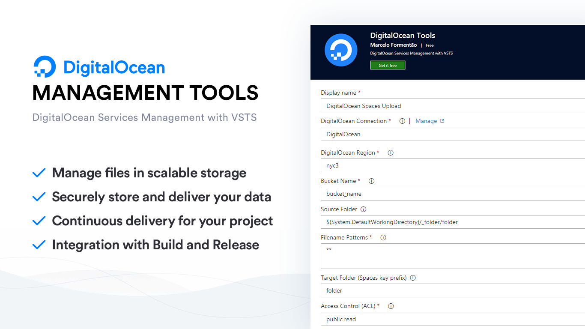

# DigitalOcean Tools

DigitalOcean Tools provide the ability to upload and delete objects from DigitalOcean Spaces in Visual Studio Team Services Build and Release Management.

## Tasks included

- [**DigitalOcean Spaces Upload:**](https://github.com/marceloavf/digitalocean-tools-vsts/wiki/DigitalOcean-Spaces-Upload) Upload file(s) and folder(s) content to DigitalOcean Spaces Bucket.
- [**DigitalOcean Spaces Delete:**](https://github.com/marceloavf/digitalocean-tools-vsts/wiki/DigitalOcean-Spaces-Delete) Delete file(s) from DigitalOcean Spaces Bucket.

## DigitalOcean Spaces Upload

- **DigitalOcean Connection:** Set the service endpoint for your connection. It's based on AWS configuration (only Access Key ID and Secret Key ID is required).
- **DigitalOcean Region:** The DigitalOcean datacenter region code containing the Spaces resource(s), e.g. nyc3, ams3, sgp1, etc.
- **Bucket Name:** The name of the bucket where the content will be uploaded.
- **Source Folder:** The source folder that the content pattern(s) will be run against. Root is assumed when empty.
- **Filename Patterns:** Glob patterns to select the file and folder content to be uploaded.
- **Target Folder:** The target folder (referred to as a key prefix in Spaces) in the bucket to contain the uploaded content. Root is assumed when empty.
- **Access Control (ACL):** The canned Access Control List (ACL) to apply to the uploaded content.
- **Flatten Folders:** Flatten the folder structure and copy all files into the specified target folder in the bucket.

## DigitalOcean Spaces Delete

- **DigitalOcean Connection:** Set the service endpoint for your connection. It's based on AWS configuration (only Access Key ID and Secret Key ID is required).
- **DigitalOcean Region:** The DigitalOcean datacenter region code containing the Spaces resource(s), e.g. nyc3, ams3, sgp1, etc.
- **Bucket Name:** The name of the bucket where the content will be deleted.
- **Filename Patterns:** Glob patterns to select the file and folder content to be deleted.
- **Target Folder:** The target folder (referred to as a key prefix in Spaces) in the bucket that contain the files. Root is assumed when empty, **be careful**.

## Install the extension to your account

You can find the latest stable version of the VSTS Extension tasks on the [Visual Studio Marketplace](https://marketplace.visualstudio.com/items?itemName=marcelo-formentao.digitalocean-tools).

## Known Issues

Please refer to our [wiki page](https://github.com/marceloavf/digitalocean-tools-vsts/wiki/Known-Issues)

## Learn More

The [source](https://github.com/marceloavf/digitalocean-tools-vsts) for this extension is on GitHub. Take a look at [contributing section](https://github.com/marceloavf/digitalocean-tools-vsts#contribute), fork and extend.

## Release Notes

Please refer to our [release page on Github](https://github.com/marceloavf/digitalocean-tools-vsts/releases)
